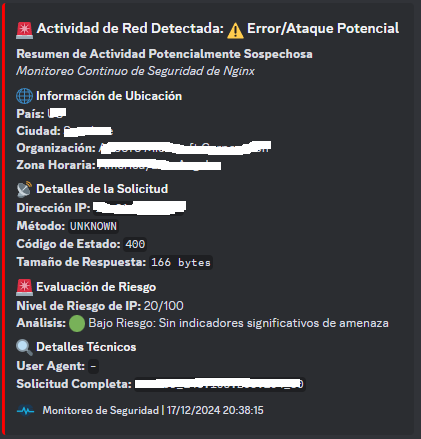

# Monitor VPS - LOG 🔍🚨
**README**: ENGLISH & ESPAÑOL


## Overview

Monitor VPS - LOG is an advanced security and monitoring tool designed to analyze Nginx web server access logs in real-time. It provides comprehensive IP intelligence, risk assessment, and instant Discord notifications for suspicious network activities.

## Resumen

Monitor VPS - LOG es una herramienta avanzada de monitoreo y seguridad diseñada para analizar en tiempo real los registros de acceso del servidor web Nginx. Ofrece inteligencia de IP detallada, evaluación de riesgos y notificaciones instantáneas a Discord ante actividades de red sospechosas.

---

## Features | Funciones

- 🌐 **Real-time log monitoring** | `Monitoreo de registros en tiempo real`
- 🚨 **Detailed IP geolocation analysis** | `Análisis detallado de geolocalización de IP`
- 📊 **Risk scoring for network requests** | `Puntuación de riesgo para solicitudes de red`
- 🔔 **Instant Discord webhook notifications** | `Notificaciones instantáneas a Discord vía webhook`
- 🔒 **Configurable IP filtering** | `Filtros de IP configurables`
- 🧵 **Concurrent log processing** | `Procesamiento concurrente de registros`

---

## Prerequisites | Requisitos previos

- **Python 3.8+**  
- **Ubuntu/Debian Linux**  
- **Nginx web server**  
- **Discord webhook**  
- **Cuenta de IPInfo** `(opcional, disponible en plan gratuito)`
https://ipinfo.io/
---

## Installation | Instalación  

### 1. Clone the Repository | Clonar el Repositorio

```
git clone https://github.com/tuusuario/monitor-vps.git
cd monitor-vps
```

### 2. Prepare Installation | Preparar Instalación

```
chmod +x setup.sh
```

### 3. Configure Settings | Configurar Opciones

Edit `config.yaml` | Edita `config.yml` :

- Set `DISCORD_WEBHOOK_URL` | Coloca `DISCORD_WEBHOOK_URL`
- Set `IPINFO_TOKEN` | Coloca `IPINFO_TOKEN`
- Customize `IGNORED_IPS` and `WHITELISTED_IPS` | Modifica `IGNORED_IPS` y `WHITELISTED_IPS`
- Verify `LOG_FILE` path | Verifica la ruta del `LOG_FILE`

### 4. Install | Instalar

```
sudo ./setup.sh
```

### Configuration Options | Opciones de Configuración
#### Discord Webhook
- Multiple webhook URLs supported | `Soporte para múltiples URL de webhook`
- Detailed security event embeds | `Eventos de seguridad detallados`
- Color-coded risk levels | `Niveles de riesgo codificados por colores`
#### IP Filtering | Filtrado de IPs
- Ignore specific IPs/networks | `Ignorar IPs o redes específicas`
- Whitelist trusted IP ranges | `Listas blancas de rangos de IP confiables`
- Customizable risk thresholds | `Umbrales de riesgo personalizables`
#### Logging | Registro
- Persistent log files | `Archivos de registro persistentes`
- Configurable log levels | `Niveles de registro configurables`
- Console and file logging | `Registro en consola y archivo`

#### Security Risk Assessment | Evaluación de Riesgos de Seguridad
The monitor assesses IP risks based on | `El monitor evalúa riesgos de IP basándose en`:

- Geolocation | `Geolocalización`
- Hosting Provider | `Proveedor de hosting`
- Country of origin | `País de origen`
- Characteristics of the requests | `Características de las solicitudes`

### Notification Details | Detalles de Notificaciones
Notifications to Discord include | `Las notificaciones a Discord incluyen`:

- Precise location information | `Información precisa de ubicación`
- Request method and status | `Método y estado de la solicitud`
- IP risk score | `Puntuación de riesgo de IP`
- Technical details of the request | `Detalles técnicos de la solicitud`

### Troubleshooting | Solución de Problemas
- Verify `/var/log/nginx-monitor/monitor.log` | Verifica `/var/log/nginx-monitor/monitor.log`
- Make sure that the Discord webhook is valid | `Asegúrate de que el webhook de Discord sea válido`
- Check the permissions of the log file | `Revisa los permisos del archivo de registro`

### Contributing | Contribuir
- Fork the repository | `Haz un fork del repositorio`
- Create your feature branch | `Crea tu rama de desarrollo`
- Commit changes | `Realiza commits de tus cambios`
- Push to the branch | `Sube los cambios a tu rama`
- Create a Pull Request | `Crea un Pull Request`

### License | Licencia

MIT License

Copyright (c) 2024 saidcveltran-dev

Permission is hereby granted, free of charge, to any person obtaining a copy of this software and associated documentation files (the "Software"), to deal in the Software without restriction, including without limitation the rights to use, copy, modify, merge, publish, distribute, sublicense, and/or sell copies of the Software, and to permit persons to whom the Software is furnished to do so, subject to the following conditions:

The above copyright notice and this permission notice shall be included in all copies or substantial portions of the Software.

THE SOFTWARE IS PROVIDED "AS IS", WITHOUT WARRANTY OF ANY KIND, EXPRESS OR IMPLIED, INCLUDING BUT NOT LIMITED TO THE WARRANTIES OF MERCHANTABILITY, FITNESS FOR A PARTICULAR PURPOSE AND NONINFRINGEMENT. IN NO EVENT SHALL THE AUTHORS OR COPYRIGHT HOLDERS BE LIABLE FOR ANY CLAIM, DAMAGES OR OTHER LIABILITY, WHETHER IN AN ACTION OF CONTRACT, TORT OR OTHERWISE, ARISING FROM, OUT OF OR IN CONNECTION WITH THE SOFTWARE OR THE USE OR OTHER DEALINGS IN THE SOFTWARE.
